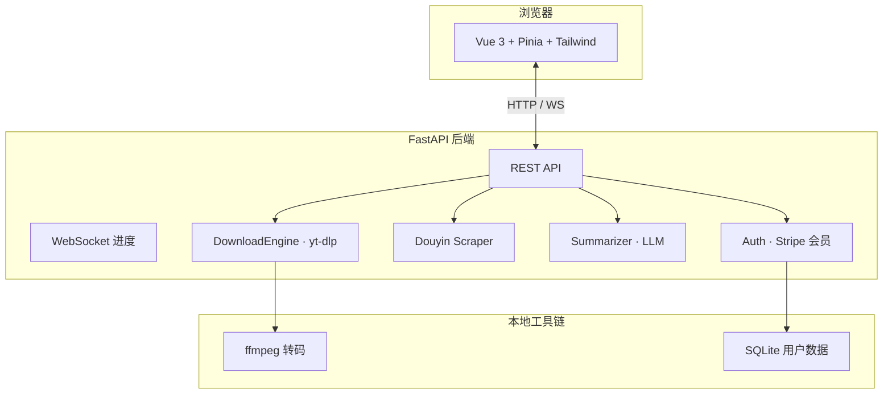

<div align="center">

# AI 万能视频下载器

**粘贴链接 · 秒级解析 · 无水印下载 · AI 一键读懂视频**

[](LICENSE)
[](backend/requirements.txt)
[](frontend/package.json)
[](backend/main.py)
[](https://github.com/yt-dlp/yt-dlp)

[快速开始](#-30-秒上手) · [功能亮点](#-功能亮点) · [支持平台](#-支持平台) · [文档](#-文档) · [部署](#-部署)

**[English](#english-summary)** | 中文

</div>

---

> 不只是「把视频拽下来」。  
> 这是一款 **本地 Web 应用**：多平台解析、实时进度、格式转换，还能用 AI 生成**内容摘要、字幕要点、思维导图**——收藏、学习、二创，一步到位。

---

## ✨ 为什么选择它？

| 痛点 | 本项目的解法 |
|------|----------------|
| 各平台工具分散、广告多 | **一个界面**搞定 YouTube / B站 / 抖音 / TikTok 等 |
| 抖音下载要 Cookie、门槛高 | **专用解析链路**，多数场景 **无需用户提供 Cookie** |
| 下完还要自己看一遍做笔记 | **AI 分析**：摘要 + 字幕要点 + **Markmap 思维导图** |
| 命令行 yt-dlp 对新手不友好 | **可视化界面** + WebSocket **实时进度** |
| 想自建 SaaS | 内置 **账号体系 + Stripe 会员 + 用量配额** |

---

## 🚀 功能亮点

### 📥 下载引擎

- **多平台解析**：基于 [yt-dlp](https://github.com/yt-dlp/yt-dlp)，覆盖 **1000+ 站点**
- **抖音专项优化**：短链 / 标准链接 / 图文笔记；**无水印**直链下载
- **格式随心选**：MP4 / WebM / 纯音频 MP3 等，支持 **ffmpeg 转码**
- **批量与队列**：播放列表解析、并发控制、速度限制
- **Cookie 可选**：B 站等高风控站点可在设置中导入浏览器 Cookie

### ⚡ 体验与性能

- **WebSocket 推送**：进度、速度、状态 **实时刷新**，不用反复刷页面
- **解析缓存**：相同链接二次解析更快
- **深色现代 UI**：Vue 3 + Tailwind，桌面浏览器体验流畅

### 🧠 AI 视频分析（可选）

配置任意兼容 API 的大模型（如 DeepSeek）后，一键生成：

| 模块 | 说明 |
|------|------|
| 📝 **内容摘要** | 结构化 Markdown，卡片式展示，支持 **导出 MD / TXT** |
| 💬 **字幕要点** | 从字幕提炼关键信息 |
| 🗺️ **思维导图** | Markmap 交互预览，支持 **导出 SVG / PNG / MD** |

> AI 能力完全可选：不配 Key 也能正常下载；Key 仅存本地配置，**不会提交到 Git**。

### 👤 会员与商业化（可选）

- 用户注册 / 登录（JWT）
- **Stripe** 订阅支付
- 每日下载次数配额、会员中心、用量 **实时更新**

适合 fork 后快速改成自己的 **Video SaaS**。

---

## 🌐 支持平台

| 平台 | 能力 | 备注 |
|------|------|------|
| **YouTube** | 解析 / 下载 / 列表 | yt-dlp 原生支持 |
| **哔哩哔哩** | 解析 / 下载 | 高画质可配 Cookie |
| **抖音** | 无水印 / 封面 | 专用 scraper，**免 Cookie** |
| **TikTok** | 解析 / 下载 | 与抖音链路协同 |
| **其他** | 1000+ 站点 | 凡 yt-dlp 支持的均可尝试 |

完整抖音实现细节见 [docs/抖音功能开发总结.md](docs/抖音功能开发总结.md)。

---

## 🎬 使用流程


1. 启动服务 → 浏览器打开 `http://127.0.0.1:9000`
2. 粘贴链接 → 点击解析
3. 选择格式 → 开始下载
4. （可选）侧边栏配置大模型 → 生成 AI 分析报告

---

## 🏗️ 技术架构



| 层级 | 技术栈 |
|------|--------|
| 前端 | Vue 3 · Vite · Pinia · Vue Router · Tailwind CSS · Markmap |
| 后端 | FastAPI · SQLite · WebSocket · httpx |
| 引擎 | yt-dlp · ffmpeg · 自研抖音解析 |
| 支付 | Stripe Checkout + Webhook |
| AI | 可插拔 LLM Provider（OpenAI 兼容 API） |

---

## ⚡ 30 秒上手

### 环境要求

- **Python 3.11+**
- **Node.js 18+**（开发或构建前端时需要）
- **ffmpeg**（转码 / 合并，需加入 PATH）

### 方式一：一键启动（Windows 推荐）

双击根目录 **`一键启动.bat`**，或在 PowerShell 中：

```powershell
powershell -ExecutionPolicy Bypass -File .\start.ps1
```

浏览器访问：**http://127.0.0.1:9000**  
（请用 Chrome / Edge 打开，勿用 IDE 内置预览）

### 方式二：手动启动

<details>
<summary><b>展开：分步启动</b></summary>

**后端**

```bash
cd backend
pip install -r requirements.txt
copy config\stripe_config.example.py config\stripe_config.py   # Windows
copy ai_config.example.py ai_config.py                         # 可选：AI 摘要
python main.py
```

**前端开发模式**（热更新，端口 3000 → 代理到 9000）

```bash
cd frontend
npm install
npm run dev
```

**生产构建**（由后端托管静态资源）

```bash
cd frontend && npm install && npm run build
cd ../backend && python main.py
```

</details>

### 方式三：Docker

```bash
docker build -t ai-video-downloader .
docker run -p 8976:8976 -v ./downloads:/app/downloads ai-video-downloader
```

---

## ⚙️ 可选配置

| 配置项 | 文件 | 用途 |
|--------|------|------|
| Stripe 支付 | `backend/config/stripe_config.py` | 会员订阅（从 example 复制） |
| AI 摘要 | `backend/ai_config.py` | 内置 summarizer（从 example 复制） |
| 大模型侧边栏 | 前端「大模型配置」 | 用户级 API Key，支持多 Provider |
| Cookie | 设置页 | B 站等站点高画质 |

> ⚠️ `stripe_config.py`、`ai_config.py` 已在 `.gitignore` 中，**切勿将真实密钥提交到仓库**。

---

## 📚 文档

| 文档 | 说明 |
|------|------|
| [docs/快速启动说明.md](docs/快速启动说明.md) | 启动方式与验证步骤 |
| [docs/需求分析文档.md](docs/需求分析文档.md) | 产品功能全景 |
| [docs/技术实现文档.md](docs/技术实现文档.md) | 架构与模块设计 |
| [docs/后端API接口文档.md](docs/后端API接口文档.md) | REST / WebSocket API |
| [docs/MEMBERSHIP_DEPLOYMENT_GUIDE.md](docs/MEMBERSHIP_DEPLOYMENT_GUIDE.md) | Stripe 会员部署 |
| [docs/DEPLOY.md](docs/DEPLOY.md) | Render / 云端部署 |
| [docs/人工配置文档.md](docs/人工配置文档.md) | 密钥与环境变量 |
| [docs/抖音功能开发总结.md](docs/抖音功能开发总结.md) | 抖音无水印方案 |

---

## ☁️ 部署

项目自带 [`render.yaml`](render.yaml) 与 [`Dockerfile`](Dockerfile)，可一键部署到 Render 或任意支持 Docker 的平台。

详见 [docs/DEPLOY.md](docs/DEPLOY.md)。

---

## 🗂️ 项目结构

```
AI万能视频下载器/
├── backend/                 # FastAPI 后端
│   ├── main.py              # 入口 · 路由 · WebSocket
│   ├── routes/              # 认证 · 会员 · LLM · 水印
│   ├── services/            # 下载 · 抖音 · 摘要 · 转码
│   └── database/            # SQLite
├── frontend/                # Vue 3 前端
│   └── src/
│       ├── components/      # 下载卡片 · AI 摘要 · 思维导图
│       ├── stores/          # Pinia 状态
│       └── views/           # 首页 · 会员 · 登录
├── docs/                    # 完整技术文档
├── 一键启动.bat              # Windows 快捷启动
├── start.ps1                # 启动脚本
├── Dockerfile
└── render.yaml
```

---

## 🤝 参与 & Star

如果这个项目帮你省下了时间——

- ⭐ **点个 Star**，让更多人发现它
- 🐛 提 [Issue](https://github.com/Drgonmancer/AI-Powered-Video-Downloader/issues) 反馈平台失效或需求
- 🔀 **Fork** 后改成你自己的视频工具 / SaaS

欢迎 PR：新平台适配、UI 优化、AI Prompt 改进均可。

---

## 📄 License

[MIT](LICENSE) — 自由使用、修改与商用，保留版权声明即可。

---

## English Summary

**AI-Powered Video Downloader** is a self-hosted web app for parsing and downloading videos from **YouTube, Bilibili, Douyin, TikTok**, and 1000+ sites via **yt-dlp**. It features real-time WebSocket progress, optional **AI summaries / transcript highlights / Markmap mind maps**, and an optional **Stripe membership** layer for SaaS-style deployments.

**Quick start:** run `start.ps1` (Windows) or `python backend/main.py`, then open `http://127.0.0.1:9000`.

---

<div align="center">

**Made with ❤️ for learners, creators, and builders who hate friction.**

[⬆ 回到顶部](#ai-万能视频下载器)

</div>
